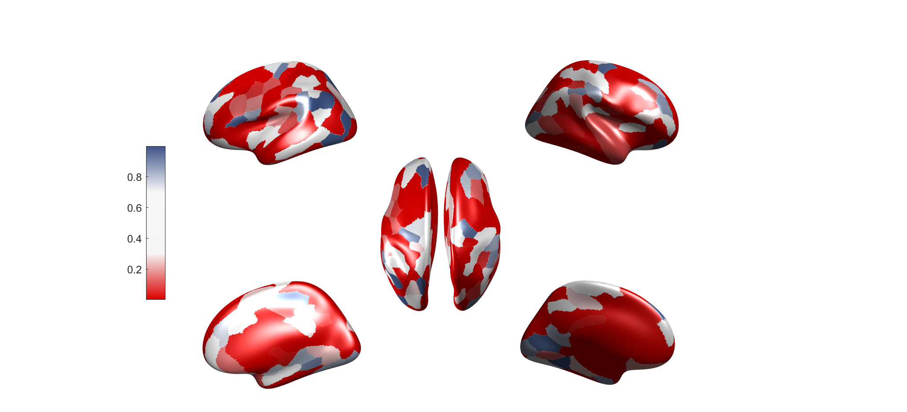

# Plot cortical thickness in brainspace (FreeSurfer) with customize color map

## Requirement

- [gifti](https://github.com/gllmflndn/gifti)
- read_notation (from [freesurfer](https://surfer.nmr.mgh.harvard.edu/))
- brain parcellation (from [CBIG](https://github.com/ThomasYeoLab/CBIG/tree/master/stable_projects/brain_parcellation/Schaefer2018_LocalGlobal/Parcellations))
  

## DEMO 
- Change your cortical thickness data and brain parcellation
- Run main.m
- Result with random cortical thickness in Schaefer atlas with 200 regions: 

